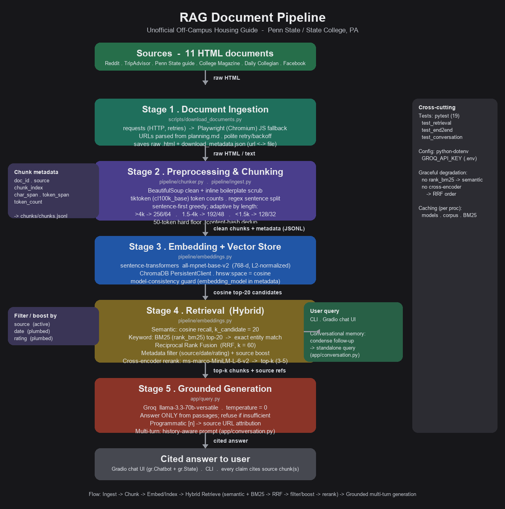

# Project 1 Planning: The Unofficial Guide

> Write this document before you write any pipeline code.
> Your spec and architecture diagram are what you'll use to direct AI tools (Claude, Copilot, etc.) to generate your implementation — the more specific they are, the more useful the generated code will be.
> Update the Retrieval Approach and Chunking Strategy sections if you change your approach during implementation.
> Update this file before starting any stretch features.

---

## Domain

<!-- What domain did you choose? Why is this knowledge valuable and hard to find through official channels? -->

&emsp;The domain for elected pursuement for the RAG Document Pipeline will be off-campus housing reviews & relevant safety information, such as reports of student apartments through forums like Reddit, CollegeConfidential, and/or Yelp reviews. 
     
&emsp;This knowledge is crucial & often hard to find due to the practical considerations of students seeking housing for the first time independently, along with the often vested interest of universities. In many institutions, such as the author's own Pennsylvania State University, housing demand far outnumbers available supply; the race to secure off-campus housing starts as early as a year prior. In addition, for many students, seeking off-campus housing may often be their first experience with factors such as leasing agreements, private property owners, and fiscal responsibility to a non-educational institution. 
     
&emsp;While it is the author's belief that most landlords are fair individuals who seek a return on their investment while providing a service to their communities, it is inevitable that in many large college towns, there exists some unscrupulous actors who fail to maintain their property, embed predatory/unenforceable clauses into the leasing agreement, or infringe on privacy such as entering without notifying a tenant. 
     
&emsp;In these situations, ignorance is often preyed upon by bad actors. Students who have only been exposed to educational institutions may falsely presume that private landlords will have their best interest at heart when signing a contract. Furthermore, in a world where even many older adults fail to read a contract carefully or have education in basic contract law, it should be no surprise that many students may fail to do so, signing predatory clauses. In addition, students may come from backgrounds where they are first-generation college students, first-time renters, or have no familial backing to help them navigate real estate contracts. 
     
&emsp;In addition, universities often have a vested financial interest, bar massive infringements, to avoid calling out these bad actors on official channels of communication. In many college towns, the institution is often one of the largest property portfolio holders. Publicly identifying bad landlords can result in devaluing surrounding real estate, spark controversy with influential donors, or hinder municipality relations. 
     
&emsp;The scope of the deficit is why access to this knowledge via unofficial forums of communication is crucial to student equity & fairness. As highlighted above, students who are from disadvantaged/non-historically represented backgrounds are often the most vulnerable to predatory practices in off-campus housing. It is the author's opinion that equalizing access to information is a key factor in driving equality. The purpose of this project shall be a case demo that tests the hypothesis that with access to information, students of all backgrounds will be able to make an educated choice in their best interests that allows them to secure safe, accessible housing from fair-practice property owners.

---

## Documents

<!-- List your specific sources: URLs, subreddit names, forum threads, or file descriptions.
     Aim for at least 10 sources that together cover different subtopics or perspectives within your domain. -->

| # | Source              |     Description       |   URL or location    |
|---|---------------------|-----------------------|----------------------|
| 1 | Reddit              |    Forum Post         | https://www.reddit.com/r/PennStateUniversity/comments/1rhinfv/apartment_recommendations/ |
| 2 | Reddit              |    Forum Post         | https://www.reddit.com/r/PennStateUniversity/comments/13hyekl/looking_for_housing_around_state_college/|
| 3 | Tripadvisor         |   Aggregation Page    | https://www.tripadvisor.com/ShowTopic-g53755-i1075-k6936316-Off_Campus_Housing-State_College_Pennsylvania.html|
| 4 | Penn State          | Official Campus Guide to Off-Campus Living | https://livingoffcampus.psu.edu/resources/article/1830-when-the-lease-starts |
| 5 | College Magazine    |    Top 10 Rating      | https://www.collegemagazine.com/ten-best-places-to-live-off-campus-at-penn-state/ |
| 6 | The Daily Collegian |    News Article       | https://www.psucollegian.com/news/penn-state-1st-year-students-discuss-finding-off-campus-housing-apartments/article_783cc63c-e4d6-11ef-8e8c-3fe7e0db1f05.html|
| 7 | The Daily Collegian |    News Article       | https://www.psucollegian.com/news/we-wanted-to-be-downtown-students-share-the-factors-behind-their-off-campus-housing-choices/article_b21d3473-49a7-4afe-b42f-bf7038d8baff.html |
| 8 | Facebook            |      Group Post       | https://www.facebook.com/groups/669735056706459/posts/2600632426950036/ |
| 9 | Reddit              |    Forum Post         | https://www.reddit.com/r/PennStateUniversity/comments/1i2u740/off_campus_housing/ |
| 10 | Reddit             |    Forum Post         | https://www.reddit.com/r/PennStateUniversity/comments/1jzuq7t/reviews_on_these_offcampus_apartments/ |

---

## Chunking Strategy

<!-- How will you split documents into chunks?
     State your chunk size (in tokens or characters), overlap size, and explain why those
     numbers fit the structure of your documents.
     A review-heavy corpus warrants different chunking than a long FAQ. -->

&emsp;Chunk size & overlap are chosen adaptively per document. We use the cleaned character length as a proxy for document type. Documents are not classified (i.e., forum post, article) explicitly; length is employed as a reliable substitute for the scope of this corpus. 

**Chunk Size & Overlap:**

| # | Document Length (Cleaned Chars) | Expected Content              | Chunk Size    | Overlap |
| 1 | >4,000                          | News articles, long guides    | 256           | 64      |
| 2 | 1,500-4,000                     | Forum threads, short articles | 192           | 48      |
| 3 | <1,500                          | Single reviews, brief posts   | 128           | 32      |

**Size Floor (Dual Mechanism):**
 - Soft Target: When a Greedy-accumulated chunk is undersized, the chunker appends the next sentence before emitting, so chunks are not cut off prematurely.
 - Hard Floor (50 Tokens): Any chunk still below 50 tokens is dropped & not embedded. This removes contentless fragments that would otherwise score deceptively high upon keyword overlap.   

**Reasoning:**
- Strategy (Sentence-First & Token Capped): Documents are cleaned, split into paragraphs, then sentence-tokenized. Chunks are built by Greedily accumulating whole sentences until the token cap is reached, which preserves coherent assetions & avoids mid-sentence cuts. A sentence longer than the cap is split token-wise as a fallback mechanism. 

- Preprocessing: HTML is normalized with BeautifulSoup (i.e., scripts/nav/footer etc. removed). Residual inline boilerplate artifacts are then scrubbed from the body text (i.e., social media share buttons, reaction counts, relative timestamps, etc.). Phrases that are immediately repeated are collapsed, a paragraph info density filter drops low-value lines, and chunks that are exact duplicates are removed via a content hash. 

- Size Rationale: Longer documents get smaller chunks (256) to keep narrative & causal context intact. Shorter documents get smaller chunks (128) to pinpoint specific claims & reduce noise. The middle tier (192 tokens) keeps medium length documents from being forced to either extreme. 

- Overlap Purpose: A 64-token overlap ensures that facts near a chunk boundary will survive intact in at least one chunk. A 32-token boundary is employed sufficiently for shorter chunks. 

- Token Counting: Token counts are measured with tiktoken (cl100k_base), a BPE library, as a stable proxy. It should be noted that this is not the embedding model's exact tokenizer, so counts are approximate budgeting figures rather than exact model tokens. All caps (<256) stay comfortably within the embedding model's 384-token maximum sequence length. No chunk is silently truncated at embed time. 

- Fallback Mode: Only if tiktoken is unavailable, we fall back to crude whitespace word counts & word-based splitting. Tokens counts are preferred whenever available. 

- Metadata Logic: Each chunk record carries doc_id, source, chunk_index, char_span, token_span, and token_count. The fields pushed to the vector store are doc_id, source, chunk_index, char_span, and token_count, ensuring enough context for precise grounding & accurate source attribution. 

- Cost & Performance: Heuristic token-aware chunking controls embedding cost & LLM context while preserving semantics. Paragraph-first logic & exact duplicate chunk removal reduces redundancy of chunks and improves attribution. 

---

## Retrieval Approach

<!-- Which embedding model are you using (e.g., all-MiniLM-L6-v2 via sentence-transformers)?
     How many chunks will you retrieve per query (top-k)?
     If you were deploying this for real users and cost wasn't a constraint, what tradeoffs
     would you weigh in choosing a different embedding model — context length, multilingual
     support, accuracy on domain-specific text, latency? -->

**Embedding Model:**
- Default (Development): `text-embedding-3-small` or `all-MiniLM-L6-v2` (fast, inexpensive).
- Higher Quality (Production): `text-embedding-3-large` (better nuance on noisy, paraphrased user text).
     - Choose multilingual or domain-finetuned embeddings for future scalability.
- Note: Use the embedding model's tokenizer (e.g., `tiktoken` family) to measure tokens for chunk budgeting.
- Note: Choose tokenizer first & remap chunk sizes accordingly. 

**Top-K Retrieval Counts:**
- Candidate Retrieval: `k_candidate = 20` (fast semantic retrieval to build a candidate set).
     - Note: Rerank with cross-encoder when precision is needed; this improves accuracy at the tradeoff of higher computing cost.
- Rerank & pass `k_final = 3–5` to the generator: `k_final = 3` for longer (256 token) chunks; `k_final = 5` for shorter (128 token) chunks.
     -- This ensures for longer chunks, context is preserved; shorter chunks gain precision
- Large aggregation or sentiment queries may need `k_final = 6–8`.
- Note: Stop concatenating chunks when adding another would exceed the LLM token budget.
     - Mathematically: sum(token_chunks) + prompt_tokens > model_context

**Retrieval strategy (Hybrid + Rerank):**

- Use hybrid approach; semantic search (embedding cosine) as the primary recall mechanism and BM25/keyword search to catch exact-entity matches (addresses, apartment names).
- Rerank the top `k_candidate` with a lightweight cross-encoder or a BM25 + embedding re-weight matrix to improve precision.
- Filter and prioritize by metadata (`source`, `date`, `rating`, `section_heading`) when the user requests it.

**Production Tradeoffs & Reflection:**

- If cost were no object, an embedding model that supports long context, multilingual text, domain finetuning for real-estate terms, and low-latency hosted or on-prem inference would be preferred.
- Tradeoff Considerations: Accuracy vs. cost vs. latency vs. privacy (hosted API vs self-host).
- Architecture Pattern: Cheap semantic index for recall + cross-encoder reranker for precision; cache embeddings and precompute reranks for popular queries.

**Evaluation & tuning:**

- Experiment Grid: Chunk sizes (128, 256, 384) × `k_final` (3, 5, 8).
- Metrics: `recall@k`, `MRR`, final-answer accuracy, hallucination rate, and latency/cost per query.
- Logging: Store retrieved chunk ids and scores for each test query to analyze failures.

---

## Evaluation Plan

<!-- List your 5 test questions with their expected correct answers.
     Questions should be specific enough that you can judge whether the system's response
     is right or wrong. "What are good dining halls?" is too vague.
     "What do students say about wait times at [dining hall name] during lunch?" is testable. -->

| # | Question | Expected answer |
|---|----------|-----------------|
| 1 | What do students say about Hendricks Investments properties? | Negative sentiment: students report management problems & advise avoiding Hendricks Investments. |
| 2 | Is downtown State College, PA expensive? | Yes, students report rental costs are higher than alternatives. |
| 3 | Do you have to act fast to get off-campus housing at Penn State? | Yes, first year students often lease for their second year during fall semester. |
| 4 | Is The Maxxen well ranked by students? | Positive Sentiment: Students describe The Maxxen as luxury furnished & generally safe. |
| 5 | Can I feasibly live off-campus with no car? | Yes, students report that State College has reliable public transport. |

**Scoring Rubric:**
- 3 (Highest): Claim supported & at least one cited chunk or clear reference from the corpus.
- 2: Correct claim but missing citation or nuance. 
- 1: Contradicts corpus, minor hallucinations, or utilizes unsupported facts. 
- 0 (Lowest): Complete chunk generation failure

---

## Anticipated Challenges

<!-- What could go wrong? Name at least two specific risks with reasoning.
     Consider: noisy or inconsistent documents, missing source attribution, off-topic
     retrieval, chunks that split key information across boundaries. -->

1. Missing/Broken Attribution: Web scrapers or HTML normalization can result in lost URLs, headings, or paragraph offsets, leading to chunking inconsistencies.
     - Mitigation Approach: Preserve the source URL, store character/token span, include short excerpt and/or heading with every chunk so answers can cite exact provenance. 

2. Noisy/Off-Topic Content: Long news articles & forum pages may include HTML elements for navigation, ads, signatures, or filler content that inflate index size & produce irrelevant retrievals. 
     - Mitigation Approach: Run boilerplate removal, dedupe near duplicates, apply an info-density filter (i.e., a small classification model) before embedding, and/or skip low value paragraphs. 

3. Key Context/Facts Split Across Chunks: Fixed splits can divide a factual claim or context from its justification.
     - Mitigation: Implement sentence-aware chunking + overlap, enforce a minimum chunk size & merge tiny fragments, unit test with targeted queries to ensure facts appear intact in at least one chunk. 

4. Privacy & Legal Risk: Forum posts may contain copyrighted content. 
     - Mitigation: Redact obvious PII, document data usage policy, prefer linking to sources rather than publication of full verbatim excerpts. 
---

## Architecture

<!-- Draw a diagram of your pipeline showing the five stages:
     Document Ingestion → Chunking → Embedding + Vector Store → Retrieval → Generation
     Label each stage with the tool or library you're using.
     You can use ASCII art, a Mermaid diagram, or embed a sketch as an image.
     You'll use this diagram as context when prompting AI tools to implement each stage. -->

---

## AI Tool Plan

<!-- For each part of the pipeline below, describe:
     - Which AI tool you plan to use (Claude, Copilot, ChatGPT, etc.)
     - What you'll give it as input (which sections of this planning.md, which requirements)
     - What you expect it to produce
     - How you'll verify the output matches your spec

     "I'll use AI to help me code" is not a plan.
     "I'll give Claude my Chunking Strategy section and ask it to implement chunk_text()
     with my specified chunk size and overlap" is a plan. -->

**Milestone 3 — Ingestion & Chunking:**
- AI Tools: GitHub Copilot (in-editor coding), Claude (design prompting & QA).
- Input to AI: planning.md Chunking Strategy, Documents List, RAG Architecture png, 2-3 Representative Raw Documents/Sample Corpus.
- Expected Output: ingest.py (load files/URLs), clean.py (BeautifulSoup for readability cleanup), chunker.py with chunk_text(text, chunk_size=256, overlap=64, min_tokens=50) returning chunks + metadata, and unit tests tests/test_chunker.py.
- Verification: Print 5 random chunks & run tests to check no empty chunks, sentence boundary alignment, and overlap correctness. Assert that total chunk count is in expected range (50-2000).

**Milestone 4 — Embedding & Retrieval:**
- AI Tools: GitHub Copilot (in-editor coding), Claude (design prompting & QA), sentence-transformers (API embeddings), ChromaDB/FAISS (vector store).
- Input to AI: planning.md Retrieval Approach, sample chunk JSON, and RAG Architecture png.
- Expected Output: embedded.py (embedded chunks), index.py (push to vector DB with metadata), retrieve.py with retrieve(query, k_candidate=20, k_final=3), and rerank.py (cross-encoded or BM25 rewrite).
- Verification: Run scripts/test_retrieval.py on 3 evaluation queries: Print top-k candidates & distances, compute recall@k/MRR, expect top distances < ~0.5 for good matches; inspect retrieved chunks manually. 

**Milestone 5 — Generation and interface:**
- AI Tools: GitHub Copilot (in-editor coding), Claude (design prompting & QA), Groq Wrapper
- Input to AI: planning.md Grounding Rules, retrieve.py outputs, RAG Architecture png. 
- Expected Output: query.py that composes a grounding prompt (e.g., context + strict instruction), calls the LLM, and returns answer + sources; app.py minimal Gradio UI & integration tests tests/test_end2end.py
     - Example Grounding Prompt: "Use only provided context; if insufficient, say 'I don't have enough info'"
- Verification: End-to-End tests for 2-3 queries; responses must cite source document names for grounding test & when out-of-scope, return the refusal phrase. Manually check at minimum one correct, one partial, one failure case & record in README.md. 

**Note to Self (Delete Later): Commit Checkpoints**
- Commit after each milestone with these files:
     - Milestone 3: ingest.py, clean.py, chunker.py, tests/test_chunker.py, requirements.txt.
     - Milestone 4: embed.py, index.py, retrieve.py, rerank.py, scripts/test_retrieval.py.
     - Milestone 5: query.py, app.py, tests/test_end2end.py, README updates.
- Add short CI/local test script to run unit + basic integration tests.